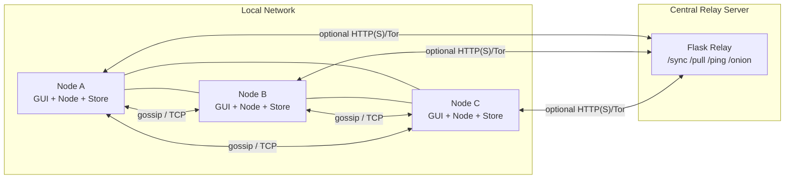
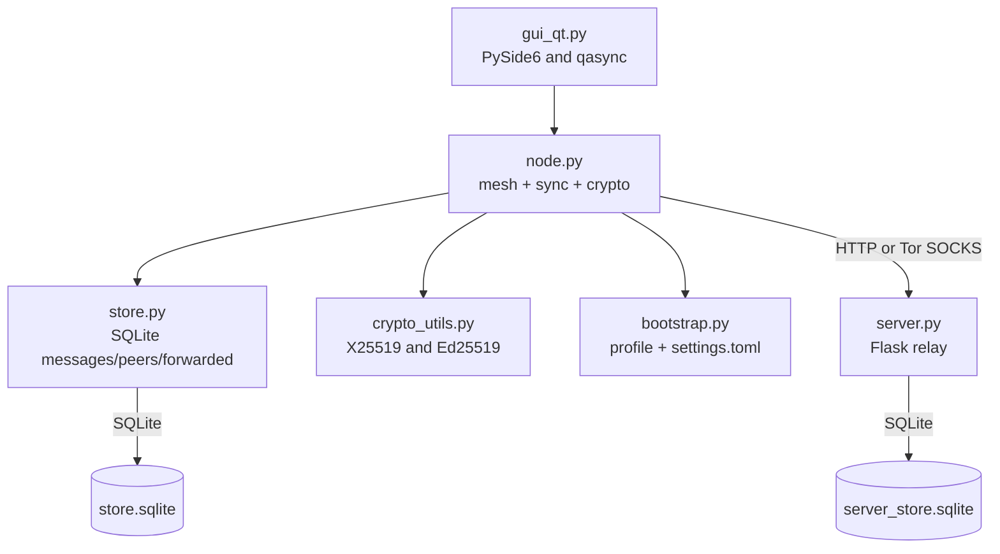
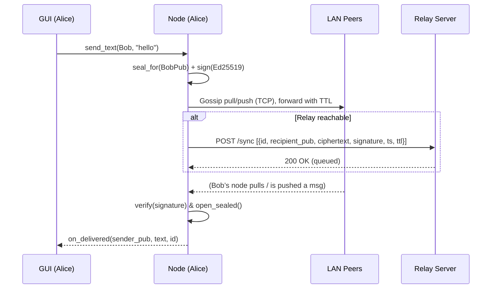

# torTalk (alpha) — Hybrid Mesh + Tor Messenger

> A minimal, privacy-first messenger that works on LAN mesh (no internet), and opportunistically syncs via a relay server — optionally over Tor.

---

## Table of Contents

- [Motivation](#motivation)
- [Features](#features)
- [Architecture](#architecture)
  - [System Diagram](#system-diagram)
  - [Components](#components)
  - [Message Flow](#message-flow)
- [Security Model](#security-model)
- [Repository Layout](#repository-layout)
- [Requirements](#requirements)
- [Installation](#installation)
- [Quick Start](#quick-start)
  - [1) Start the Relay Server](#1-start-the-relay-server)
  - [2) Start the GUI](#2-start-the-gui)
  - [3) Safety (Tor)](#3-safety-tor)
- [Configuration (`settings.toml`)](#configuration-settingstoml)
- [How It Works](#how-it-works)
  - [Discovery](#discovery)
  - [Mesh Gossip Protocol](#mesh-gossip-protocol)
  - [Dedupe & Stable IDs](#dedupe--stable-ids)
  - [Server Sync](#server-sync)
  - [Safety (Tor) Details](#safety-tor-details)
- [Verifying Privacy / What the Server Sees](#verifying-privacy--what-the-server-sees)
- [Troubleshooting](#troubleshooting)
- [Roadmap](#roadmap)
- [License](#license)
- [Acknowledgements](#acknowledgements)

---

## Motivation

- **Work offline / low-connectivity.** On the same Wi-Fi/LAN, nodes discover each other and exchange messages peer-to-peer — no internet needed.
- **Resilient delivery.** If peers aren’t reachable, messages are queued and later synced via a simple relay server.
- **Privacy-first.** Message bodies are end-to-end encrypted and signed. The relay never sees plaintext.
- **Transport privacy.** When Safety is ON, server sync runs behind Tor (SOCKS). If the server exposes a `.onion`, the client can switch to it.

---

## Features

- **LAN mesh messaging** with UDP multicast discovery and TCP gossip.
- **Store-and-forward** using a tiny Flask relay (`/sync` + `/pull`).
- **E2E crypto**: X25519 sealed boxes + Ed25519 signatures.
- **GUI** (PySide6 + qasync): usernames, people list, chat panes, Tor toggle.
- **Optional Tor**: reuse system Tor or spawn a private Tor via `stem`.

---

## Architecture

### System Diagram



### Components



### Message Flow



---

## Security Model

- **Confidentiality:** Each message is encrypted with a sealed box (X25519). Only the recipient’s private key can decrypt.
- **Authenticity:** Each message includes an Ed25519 signature by the sender.
- **Server blindness:** The relay stores ciphertext + routing metadata only (no plaintext).
- **Transport privacy:** When Safety is ON, server sync uses Tor via local SOCKS. If a `.onion` is returned by `/onion`, the client can switch to it.
- **Out of scope (current):** LAN traffic analysis, metadata minimization beyond pubkeys, advanced replay protections over very long time windows.

---

## Repository Layout

```
.
├── gui_qt.py          # Desktop GUI (PySide6 + qasync + Tor manager)
├── node.py            # Discovery, mesh gossip, server sync, crypto glue
├── store.py           # SQLite store: messages, peers, forwarded dedupe
├── server.py          # Flask relay: /sync, /pull, /ping, /onion (optional)
├── bootstrap.py       # Per-profile bootstrap + settings.toml
├── crypto_utils.py    # Key handling + seal/sign/verify helpers
├── init_node.py       # (optional helper) initialize a node/config
├── print_pubkey.py    # (optional helper) show public address
└── requirements.txt   # Python deps
```

---

## Requirements

- Python **3.11+**
- Optional: **Tor**
  - macOS: `brew install tor`
  - Debian/Ubuntu: `sudo apt install tor`
  - Windows: Tor Expert Bundle — ensure `tor.exe` on PATH or set `TOR_BINARY` env var

**Python dependencies (suggested `requirements.txt`):**
```text
PySide6
qasync
stem
pynacl
requests
flask
flask-cors
msgpack
```

---

## Installation

```bash
python -m venv .venv
source .venv/bin/activate                 # Windows: .venv\Scripts\activate
pip install -r requirements.txt
```

---

## Quick Start

### 1) Start the Relay Server

```bash
# (optional) if you have a Hidden Service already:
export MESH_ONION=yourhiddenserviceaddress.onion   # no protocol, just host.onion
python server.py
```

- `GET /ping` — health check  
- `POST /sync` — accept batch of ciphertext messages  
- `GET /pull?recipient=<pub>` — deliver queued messages  
- `GET /onion` — advertises `.onion` if `MESH_ONION` is set

### 2) Start the GUI

Open **two terminals** (to simulate two users on the same machine/network):

```bash
python gui_qt.py
```

- Type a **username** (e.g., “Alice”), click **Register / Start**.
- In the second terminal, run GUI again for “Bob”.

You should see one another appear under **People (nearby)** within a few seconds (multicast discovery). Double-click a name to open a chat pane, then send messages.

> **Tip (macOS):** If you use the macOS firewall, allow Python to receive incoming connections so UDP multicast/TCP gossip works.

### 3) Safety (Tor)

- Toggle **Safety (Tor)** in the GUI:
  - If **system Tor** is running on `127.0.0.1:9050`, it will be used.
  - Otherwise, a **private Tor** is launched inside your profile directory (via `stem`).

GUI status will show: `Safety mode: ON (socks5h://127.0.0.1:<port>)`.  
If your server provides `/onion`, the client will attempt to switch to it when Safety is ON.

---

## Configuration (`settings.toml`)

A profile directory contains your settings, identity, and local DB:

```
<platform-data-dir>/torTalk/<profile>/
 ├── settings.toml
 ├── identity.bin
 └── store.sqlite
```

Typical `settings.toml`:

```toml
[identity]
path = "/…/torTalk/Alice/identity.bin"

[storage]
path = "/…/torTalk/Alice/store.sqlite"

[network]
tcp_port = 45454

[server]
url = "http://127.0.0.1:8080"
safety_mode = false
# tor_socks = "socks5h://127.0.0.1:9050"   # set when Safety ON

[user]
username = "Alice"
```

> The GUI and node will read this file. If you add persistence helpers, they can also write updates back when you toggle Safety or change the server URL.

---

## How It Works

### Discovery

- Each node periodically multicasts a **hello** beacon (UDP to `239.1.2.3:54545`) with:
  - `pub` (encryption pubkey, base64)
  - `port` (TCP gossip port)
  - `username`
- Peers are saved in SQLite with `last_seen`, host, port, username.

### Mesh Gossip Protocol

- Each node runs a TCP listener on its gossip port.
- A peer connects and sends:
  ```json
  {"type": "pull", "pub": "<my_pub_b64>"}
  ```
- The listener replies with:
  - `{"type":"push","count":N}`
  - followed by `N` messages as `{"type":"msg","data":{...}}`
  - `{"type":"end"}`
- Messages are delivered E2E encrypted. Signatures are verified on receipt. If a message is not for us, it can continue circulating with `ttl-1`.

### Dedupe & Stable IDs

- Each message ID is a BLAKE2b hash over:
  ```text
  blake2b(sender_pub_b64 | "|" | recipient_pub_b64 | nonce)
  ```
- A `forwarded(peer_pub, msg_id)` table prevents resending the same message to the same peer.
- The combination of **stable IDs**, **TTL**, and `forwarded` yields one delivery.

### Server Sync

- When reachable, nodes:
  - `POST /sync` with any **unsynced** messages (ciphertext + metadata).
  - `GET /pull?recipient=<pub>` to fetch queued messages for us.
- The relay only stores ciphertext and routing fields (`id`, `recipient_pub`, timestamps).

### Safety (Tor) Details

- The GUI toggles **Safety (Tor)**:
  - If **system Tor** at `127.0.0.1:9050` is up, use it.
  - Else spawn a **private Tor** with `stem` in `…/<profile>/tor/` and a random SOCKS port.
- The node’s `requests.Session` proxies are updated to point at the SOCKS endpoint.
- If the server returns a `.onion` from `/onion`, the GUI may switch the node’s `server_url` accordingly.

---

## Verifying Privacy / What the Server Sees

On the relay server, inspect `server_store.sqlite`:

```sql
-- SQLite shell:
sqlite3 server_store.sqlite
.headers on
.mode column
SELECT id, recipient_pub, length(payload) AS payload_bytes FROM messages LIMIT 5;
```

The `payload` is a JSON blob containing **ciphertext** and metadata only. The server cannot decrypt message bodies.

**Network verification:**

- With Safety OFF, relay access logs show your public IP.
- With Safety ON and a `.onion` server URL, relay should see Tor exit traffic instead (or be entirely behind Tor with no clearnet exposure if both sides are .onion).

---

## Troubleshooting

- **No peers in People:**
  - Ensure both clients are on the same L2 network/SSID.
  - Verify multicast and TCP ports are open.
  - Check:
    ```bash
    lsof -n -iUDP:54545      # both clients should have a UDP socket
    lsof -n -iTCP:45454      # and a TCP LISTEN (or your configured ports)
    ```
- **No delivery over mesh:**
  - Watch the terminal for `[DELIVERED]` logs.
  - Ensure both clients run and see each other in People.
- **No delivery via relay:**
  - Watch server logs for `/sync` and `/pull`.
  - Verify `server.url` is correct and reachable from the client host.
- **Tor fails to start:**
  - Install Tor (`brew install tor` or your OS package manager).
  - Ensure `stem` is installed.
  - Set `TOR_BINARY` if `tor` isn’t on PATH.
- **Duplicate messages:**
  - Ensure `store.mark_forwarded(peer_pub, msg_id)` is called for each pushed message.
  - Ensure `outbox_for_recipient()` excludes IDs already forwarded to that peer.

---

## Roadmap

- Remove temporary “admin mode” and enforce friend-only ACLs by default.
- QR onboarding (exchange keys via QR).
- File/attachment support with chunking.
- Receipts/acks and smarter retry.
- Mobile builds (PySide/Kivy/native).
- Opportunistic NAT traversal / WebRTC datachannels.
- Automatic onion service provisioning and life-cycle management.

---

## License

TBD — pick your preferred open-source license.

---

## Acknowledgements

- **PyNaCl** (libsodium/NaCl) for crypto primitives.
- **PySide6 + qasync** for the async desktop UI.
- **Stem** for Tor control and launching.
- **Flask + Flask-CORS** for the minimal relay server.
